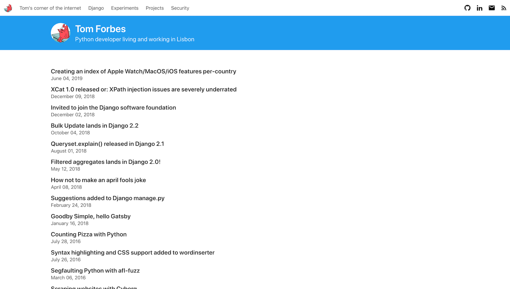
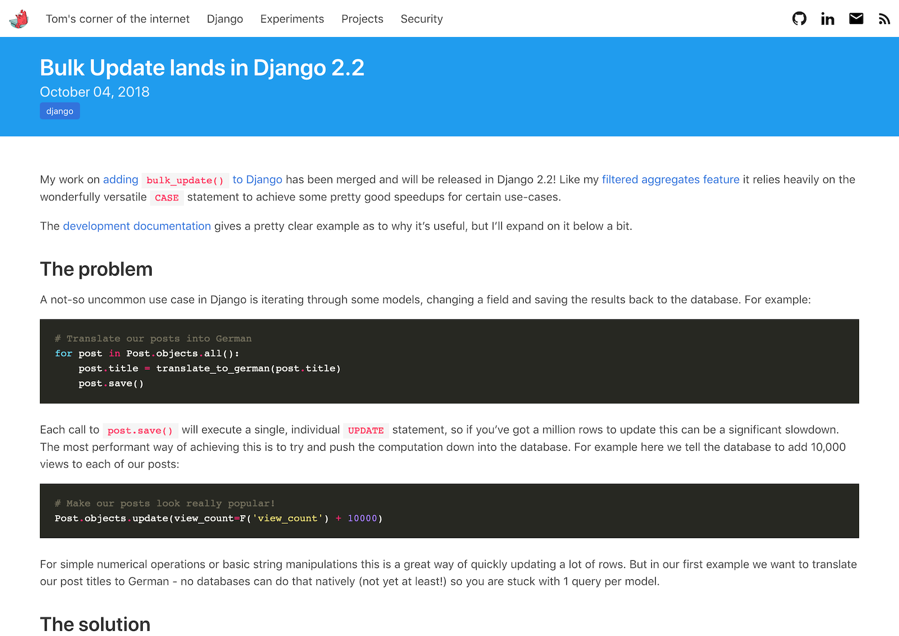

# Bare

A speed-focused, minimalist Hugo blog theme based on [Bulma.io](https://bulma.io/).

Homepage                     |  Post
:---------------------------:|:-------------------------:
 |  

## How to use:

Install the theme:

```
git submodule add https://github.com/orf/bare-hugo-theme.git themes/bare
# This is required:
git submodule update --init --recursive --depth=1
```

## Configuring the theme

Example configuration:

```toml
[params]
mainSections = ["posts"]
author = "Tom Forbes"
email = "tom@tomforb.es"
description = 'Python developer living and working in Lisbon'
postcss = true
```


The theme will pull posts from the content sections you define in `mainSections`. In the example above 
all posts from `content/posts` will be included in the homepage.

### PostCSS

You can use `postcss` to strip out all the unused Bulma CSS rules. This brings the CSS bundle down 
from 180kb to 10kb. 

To enable this set `params.postcss` to `true` in your `config.toml`. Then, copy the `package.json` and the 
`postcss.config.js` into your repository and run `npm install`.

### Social buttons

Social buttons can be configured by adding a `params.social` array. Icons come from 
https://materialdesignicons.com/:

```toml
[[params.social]]
icon = "github-circle"
url = "https://github.com/my-github-user/"

[[params.social]]
icon = "linkedin"
url = "https://linkedin.com/in/my-username"
```

### Hiding the theme link

I get it, you might not want to have a link to this repo on the footer of your blog. Add `disableAttribution` to your 
site parameters and it will be hidden. 