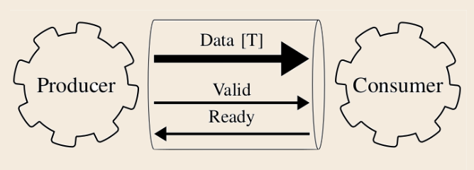
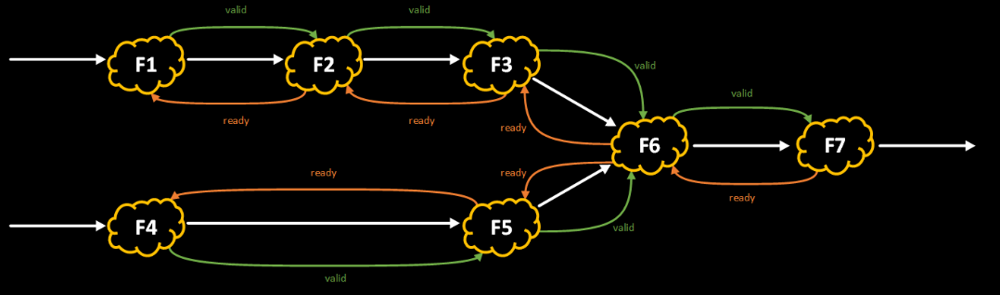
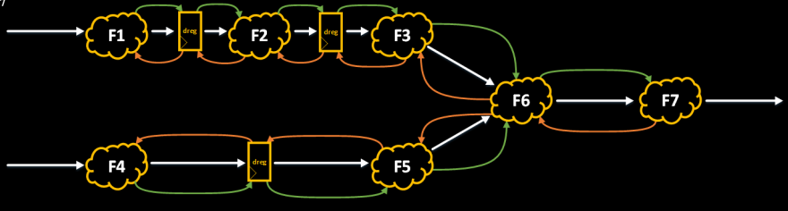
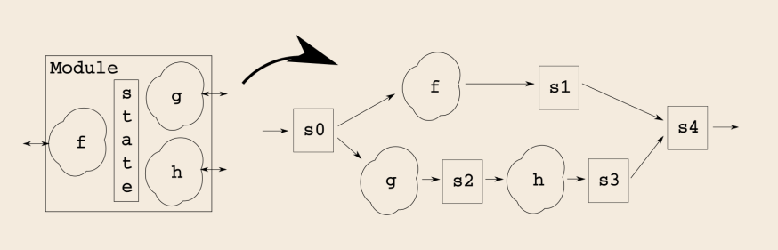
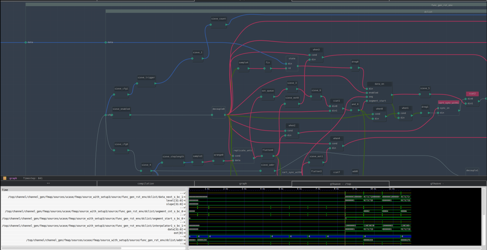

PyGears is a hardware description language (HDL) implemented as a Python library focused on module composition and synchronization. Main goals of PyGears can be summed up as:
- **Enable modular way of building digital hardware out of reusable components**. Using well thought-out and well tested libraries speeds up the implementation, reduces the number of bugs and helps with architectural choices
- **Design digital hardware in Python** using high-level constructs to reduce the number of bugs, and utilize Python’s large library ecosystem
- **Embed methods for module synchronization into the language** to reduce the verification efforts and enhance composability

####Single intefrace type
Everything in PyGears is connected together using a single interface type described in the image below. This is a simple handshaking interface that helps make sure that both producer and consumer modules agree when the data transfer happened.


By using a single interface type, the compatibility of the modules is ensured. This then enables building useful reusable module libraries by making the library modules easier to use with new designs. Also, debugging and maintaining the designs is much easier when there are not a lot of different of interfaces to master.

Of course, the type of the data being transferred can be freely selected, but the protocol is fixed. Even though this might seam as limiting, it is all that is needed for implementing high performance computing algorithms. Even some complex interfaces like AXI can be directly mapped on a number of handshake interfaces described above.

####Synchronization
Methods for module synchronization are embedded into the language and are not optional. This way the user is forced to think about the system consistency from the beginning. This dramatically reduces the verification efforts, since most of the bugs are avoided by design.

This is really useful with pipeling for an example, where registers that respect the handshaking protocol can be easily placed without changing the system consistency (in some cases parallel dataflow branches need to be matched in the number of pipeline stages)

In scientific literature, this type of synchronized design is known as “Latency-insensitive design”, and was theoretically described here: [Theory of Latency-Insensitive Design](http://web1.cs.columbia.edu/~luca/research/lipTransactions.pdf)

####Data types
PyGears introduces various data types which serve several purposes:
- They help discover bugs at compile time when incompatible module are connected
- They allow additional automation based on the data type choice
- Generic data types help write polymorphic modules, which can in turn be reused in wider variety of situations

Following data types are currently supported:
- **Int[W]/Uint[W]** - signed and unsigned integer types of variable width
- **Fixp[I, W]/Ufixp[I, W]** - signed and unsigned fixed point types with variable width and format
- **Array[T, N]** - an array of types T, of length N
- **Tuple[T1, T2, …]** - a tuple/record of arbitrary number of types
- **Union[T1, T2, …]** - a tagged union type
- **Queue[T, lvl]** - a type modeling a transaction, containing a delimiter field

####Functional style
Mandatory flow control makes interfacing modules look less like signal wave generation and more like passing data to functions, which in turn raises the level of abstraction and makes it easier to reason about the design.

Traditional design resembles Object Oriented Programming (OOP) with anthropomorphic modules built around some state that often offer very complex interfaces. Since primary strength of the hardware implementation is massively parallel execution, ensuring consistency interacting with such module is quite a challenge. Furthermore, such modules are usually hard to reuse, since they incorporate a lot of functionality.


####HLS
PyGears can compile small modules implemented using sequential logic in Python into parallel hardware description. This speeds up the development and reduces the number of bugs. There is specialized syntax for dealing with handshaking interface in an optimal manner.

```python
@gear
async def wr_req(din: Queue, *, w_addr) -> Tuple[Uint['w_addr'], 'din.data']:
    cnt = Uint[w_addr](0)
    async for d, _ in din:
        yield cnt, d
        cnt += 1
```

###Verification
With PyGears both the design and verification environment are implemented in Python, using completely identical style. On one hand it removes the need for team to master two different languages/styles, and on the other it offers a way of incrementally converting a high level module description used for verification to a synthesizable one. 

Next, significant efforts with verifying hardware designs go to building “drivers” and “monitors”. The drivers feed the data to modules in a way they are able to understand, i.e. by complying with their interfaces, while monitor decode the data from the interfaces. PyGears has a single interface type, so it is trivial to write drivers and monitors.

PyGears features a Simulator that can execute both the modules described in Python directly, and co-simulate the design by first compiling the Python description to HDL and using a third-party RTL simulator. Builtin synchronization allows the PyGears simulator to executes the modules in a much more deterministic manner (in a form of a directed acyclic graph) than the event driven simulators do. This allows the developer to understand what’s happening in the design on a much higher level. Furthermore, the Simulator can be run in a debug mode, where powerful Python debugging capabilities are available to the developer.

Finally, huge Python library ecosystem is available for use in functional verification and process automation. It is usually very easy to find or build a reference design implementation in Python.

####Ecosystem
- Wide variety of IDEs available for all major OS-es
- There is vast Python library ecosystem which can be easily used for verification with PyGears
- Python is one of the most used languages in the world, and has a gentle learning curve
- Python is apt at integration with third-party tools
